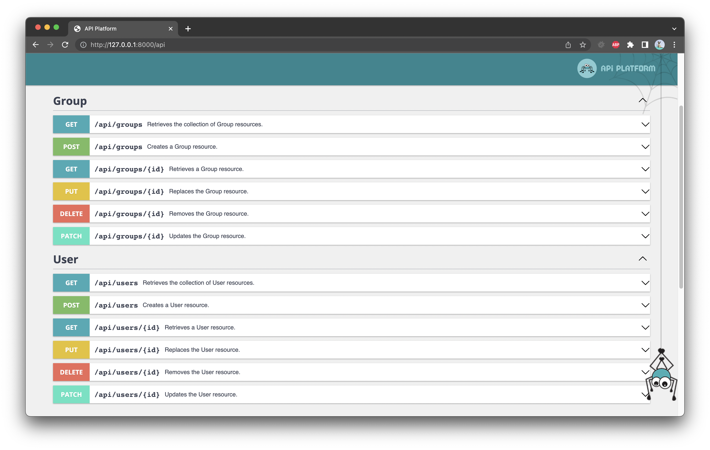

# symfony-api

### Sample API variations based on enterprise-level framework.

⚙️ Deployed on <a href="https://oleksiivelychkosymfonyapi.herokuapp.com/api">Heroku</a>

The first version of API based on <a href="https://api-platform.com/">API Platform</a>
and available at http://127.0.0.1:8000/api as default endpoint.

🔧 TODO:

- [x] Dockerized app.
- [ ] Cover by mock tests.
- [ ] Transform requests into DTO.
- [ ] Translate validation messages.